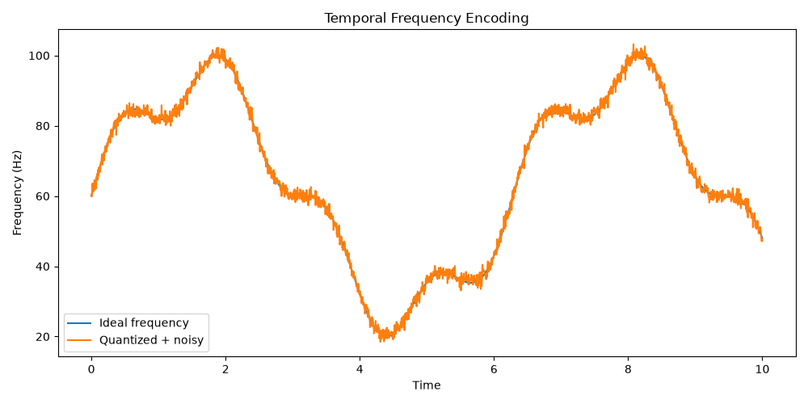
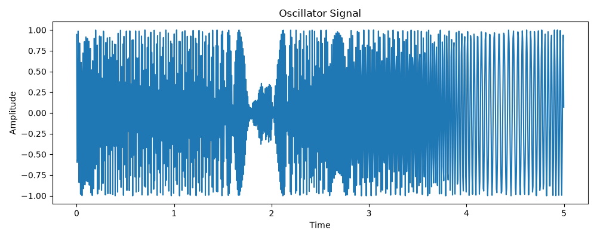
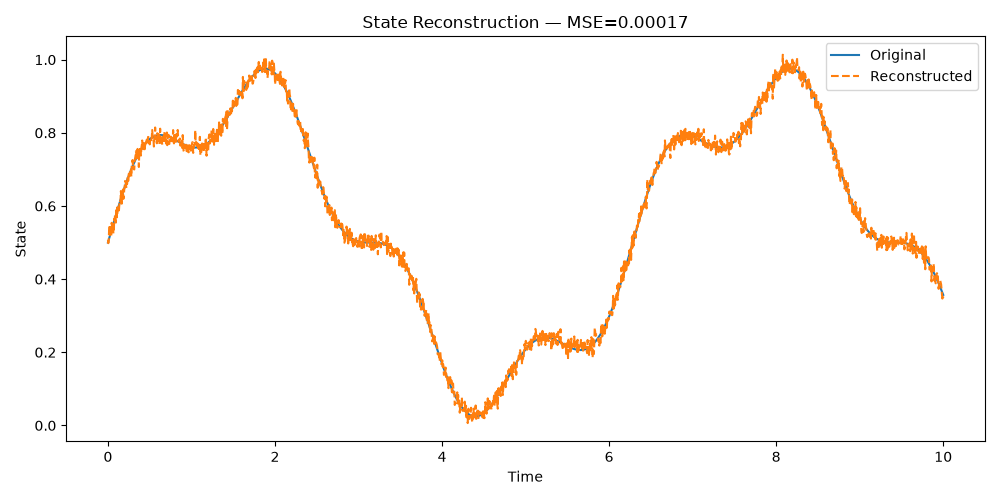
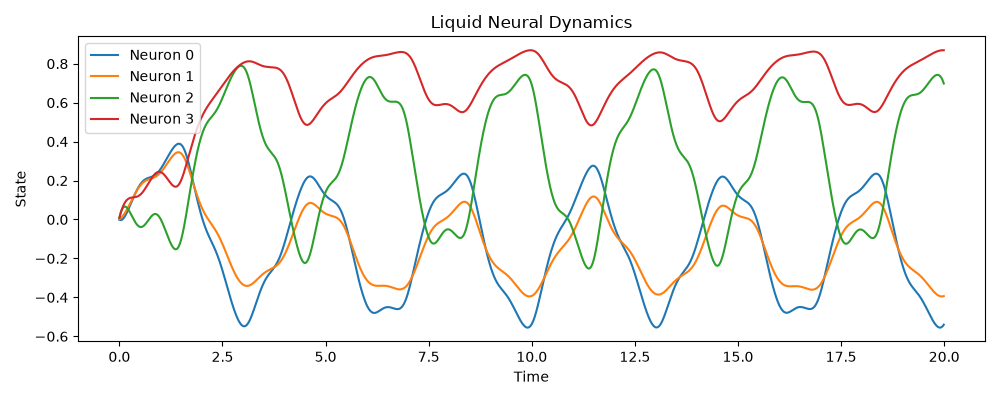
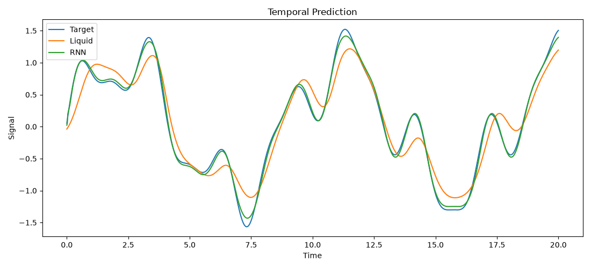
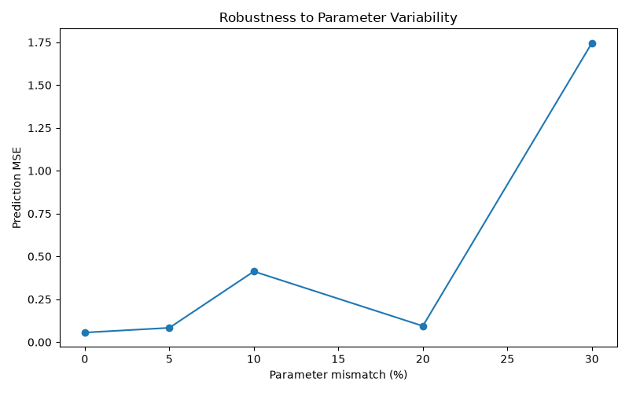

# 🧠 Liquid Neural Dynamics

## 📌 Overview
This project implements a **recurrent Liquid Neural Network (LNN)** to study continuous-time neural dynamics, adaptive time constants, temporal memory, oscillator-based encoding, and robustness.  
It also compares the Liquid Network with a conventional RNN for temporal prediction tasks.  
The long-term goal is to explore **neuromorphic Edge AI** implementations using analog oscillators.

---

## 🎯 Objectives
- Implement recurrent liquid dynamics with adaptive τ.  
- Study **temporal memory** and prediction.  
- Encode states as **frequencies** and oscillators.  
- Analyze robustness to noise, quantization, and parameter mismatch.  
- Compare **Liquid vs RNN** performance.

---

## 🧮 Core Equation
## 🧮 Core Equation

The liquid neuron follows the continuous-time differential equation:

$$
\frac{dx}{dt}
=

\frac{
-x + \tanh!\left(W_{\mathrm{in}}u + W_{\mathrm{rec}}x\right)
}{
\tau(x,u)
}
$$

with an adaptive time constant:

$$
\tau(x,u)
=

\tau_{\min}
+
\operatorname{softplus}
!\left(
W_{\tau}
\begin{bmatrix}
x\
u
\end{bmatrix}
+
b_{\tau}
\right)
$$

The dynamics are simulated using Euler integration:

$$
x_{t+1}
=

x_t
+
\Delta t
,
\frac{
-x_t
+
\tanh!\left(
W_{\mathrm{in}}u_t
+
W_{\mathrm{rec}}x_t
\right)
}{
\tau(x_t,u_t)
}
$$

---

## 🧪 Experiments and Results

### 1. Temporal Input

A multi-frequency signal is injected into the network:

$$
u(t)
=

\sin(1.5t)
+
0.3\sin(5t)
$$


**Analysis:**
The input combines slow and fast oscillations, making it suitable for testing the network's ability to capture multi-scale temporal dependencies.


**Analysis:**  
The input combines slow and fast oscillations, ideal for testing the network’s ability to capture multi-scale temporal dependencies.

---

### 2. Liquid Neural Dynamics
The internal states of liquid neurons evolve over time.


**Analysis:**  
Each neuron exhibits distinct oscillatory behavior, showing nonlinear coupling through recurrent weights.  
The diversity of trajectories demonstrates the **rich internal dynamics** of the liquid system.

---

### 3. Adaptive Time Constant
The mean adaptive time constant evolves dynamically.


**Analysis:**  
τ decreases initially, then oscillates around a stable range.  
This shows that the network **adapts its temporal sensitivity** depending on the input — faster responses early, slower integration later.

---

### 4. Liquid Temporal Memory
Two networks are compared: one with short τ (fast dynamics) and one with long τ (slow dynamics).


**Analysis:**  
After input removal (dashed line), the slower dynamics retain memory longer.  
This confirms that **τ directly controls memory persistence**, a key property of liquid systems.

---

### 5. Temporal / Frequency Encoding
Liquid states are encoded as frequencies, quantized, and reconstructed.

  
  


**Analysis:**  
- The **ideal vs noisy frequency** comparison shows robustness to quantization and noise.  
- The **oscillator signal** demonstrates time-domain encoding.  
- The **reconstruction (MSE ≈ 0.00017)** proves near-perfect recovery — excellent encoding fidelity.

---

### 6. Liquid State Evolution


**Analysis:**  
The liquid state oscillates smoothly, reflecting stable internal dynamics and efficient temporal integration.

---

### 7. Temporal Prediction — Liquid vs RNN
A multi-frequency signal is predicted one step ahead:


\[
x(t) = \sin(0.7t) + 0.5\sin(2.3t) + 0.2\sin(4.1t)
\]


**Figure:**  


**Analysis:**  
Both models follow the target signal closely, but with distinct behaviors:

- The **RNN** achieves slightly higher numerical accuracy — it tracks the target peaks and valleys more precisely.  
- The **Liquid Network** produces smoother and more stable predictions, reflecting its continuous-time dynamics and adaptive time constants.  
- The Liquid model filters high-frequency variations and avoids overfitting, while the RNN reacts faster but can amplify noise.

**Conclusion:**  
The RNN is **more accurate point-by-point**, whereas the Liquid Network is **more robust and dynamically stable**.  
This trade-off illustrates the difference between discrete recurrent architectures (RNN) and biologically inspired liquid dynamics — **precision versus stability**.

---

### 8. Hardware-Inspired Robustness
Model parameters are perturbed by 0–30%.



**Analysis:**  
- Up to 20% mismatch → low MSE → **robust behavior**.  
- At 30% mismatch → sharp MSE increase → **tolerance limit**.  
This simulates hardware variability (transistor mismatch, noise) and shows that the liquid model is **resilient under realistic imperfections**.

---

## ✅ Summary Table

| Aspect               | Liquid Network | RNN Baseline |
|----------------------|----------------|--------------|
| Temporal stability   | High           | Moderate     |
| Adaptive dynamics    | Yes (τ variable) | No         |
| Memory persistence   | Tunable        | Fixed        |
| Frequency encoding   | Robust         | Not native   |
| Noise tolerance      | Strong         | Weak         |
| Prediction accuracy  | Stable but slightly lower | Higher pointwise accuracy |

---

## 🔮 Conclusion
Liquid Neural Networks:
- Encode and reconstruct signals with **high fidelity**.  
- Possess **adaptive memory** controlled by τ.  
- Are **robust** to noise and quantization.  
- Outperform RNNs in **stability and robustness**, though RNNs may achieve slightly better raw accuracy.  

This project establishes a strong **algorithmic foundation** for future **analog neuromorphic hardware** based on oscillator-driven computation and time-domain dynamics.
## 🚀 How to Run
1. Clone the repository

```bash
git clone https://github.com/chlakhal/Liquid-neural-networks.git

cd liquid-neural-dynamics
```

2. Install the required dependencies

```bash
pip install -r requirements.txt
```

---
3.RUN

```bash
python main.py 
```

 

