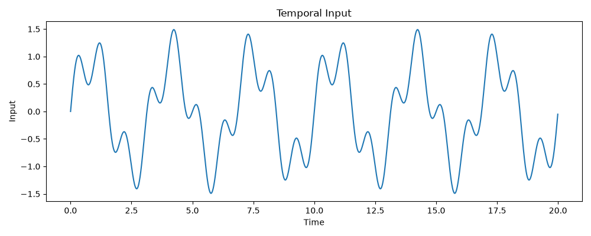
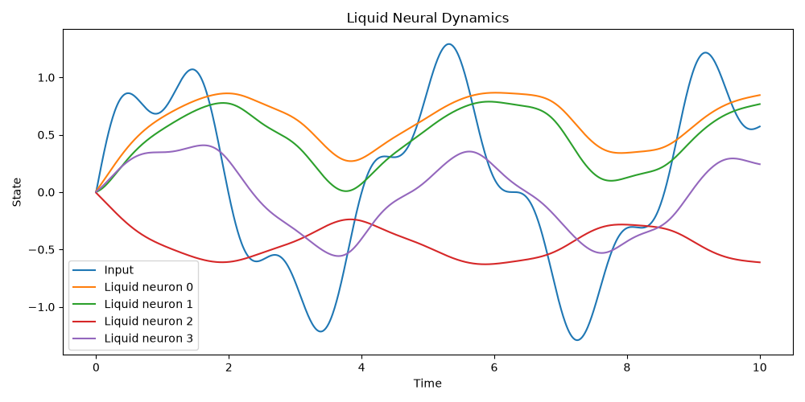
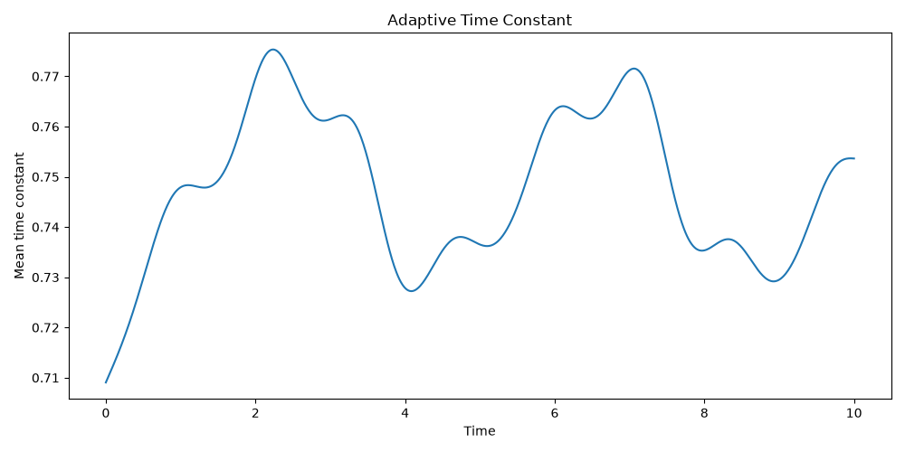
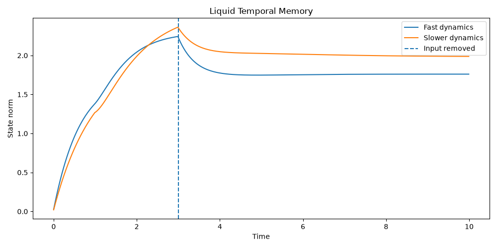

# 🧠 Liquid Neural Dynamics

## 📌 Overview

This project implements a **recurrent Liquid Neural Network (LNN)** to study continuous-time neural dynamics, adaptive time constants, temporal memory, oscillator-based encoding, and robustness.

It also compares the Liquid Network with a conventional RNN for temporal prediction tasks.

The long-term goal is to explore **neuromorphic Edge AI** implementations using analog oscillators.

---

## 🎯 Objectives

- Implement recurrent liquid dynamics with adaptive τ.
- Study **temporal memory** and prediction.
- Encode states as **frequencies** and oscillators.
- Analyze robustness to noise, quantization, and parameter mismatch.
- Compare **Liquid vs RNN** performance.

---

## 🧮 Core Equation

The liquid neuron follows the continuous-time differential equation:

}{\tau(x,u)})

**Explanation:**
-  : neuron state  
-  : input signal  
-  : input weights  
-  : recurrent weights  
- ) : adaptive time constant  

This equation describes how the neuron’s state evolves continuously over time, balancing decay and nonlinear input/recurrent contributions.

---

### Adaptive Time Constant

The time constant is adaptive:

=\tau_{min}+\operatorname{softplus}(W_{\tau}[x;u]+b_{\tau}))

**Explanation:**
-  controls how quickly the neuron reacts.  
- It changes depending on both the current state and the input.  
- The `softplus` ensures positivity, so the time constant never becomes negative.  

---

### Euler Integration

The dynamics are simulated using Euler integration:

}{\tau(x_t,u_t)})

**Explanation:**
- Computers simulate discrete steps, so continuous dynamics are approximated using **Euler integration**.  
- At each step, the state is updated by adding the derivative scaled by the timestep .  

---

## 🧪 Experiments and Results

### 1. Temporal Input

A multi-frequency signal is injected into the network:

=\sin(1.5t)+0.3\sin(5t))

**Explanation:**
The input combines slow and fast oscillations, making it suitable for testing the network's ability to capture multi-scale temporal dependencies.

---

### 2. Liquid Neural Dynamics

**Analysis:**
Each neuron exhibits distinct temporal behavior due to the recurrent coupling, demonstrating the rich internal dynamics of the liquid system.

---

### 3. Adaptive Time Constant

**Analysis:**
The time constant changes according to the state and input, allowing the network to adapt its temporal sensitivity.

---

### 4. Liquid Temporal Memory

Two networks are compared: one with short τ and one with longer τ.

**Analysis:**
After input removal, the slower dynamics retain the internal state for longer
